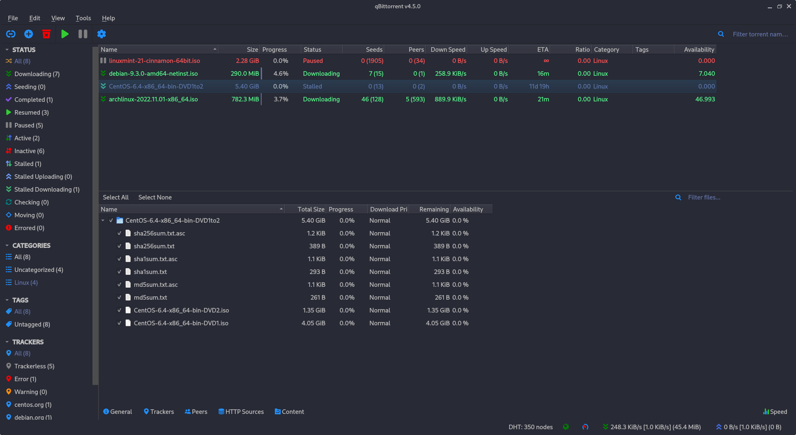
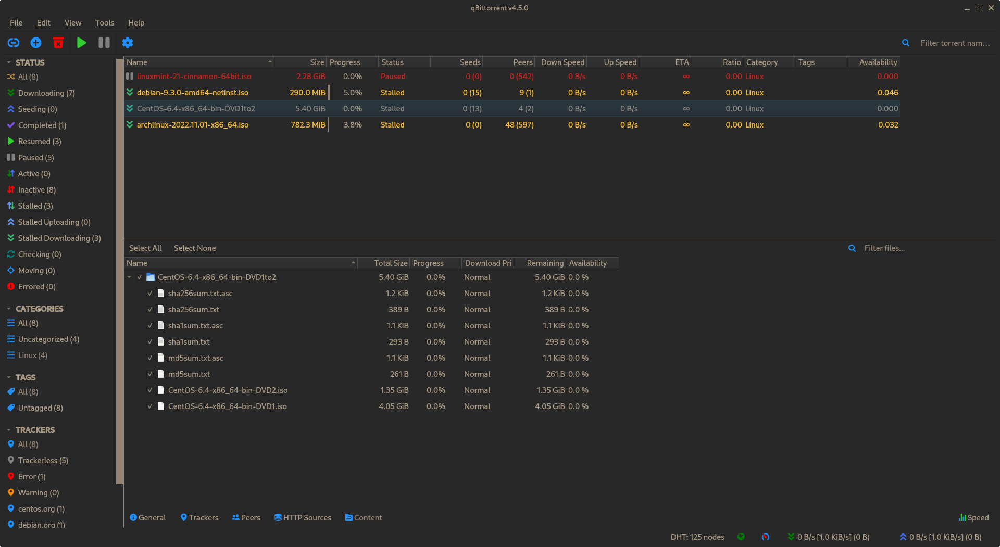
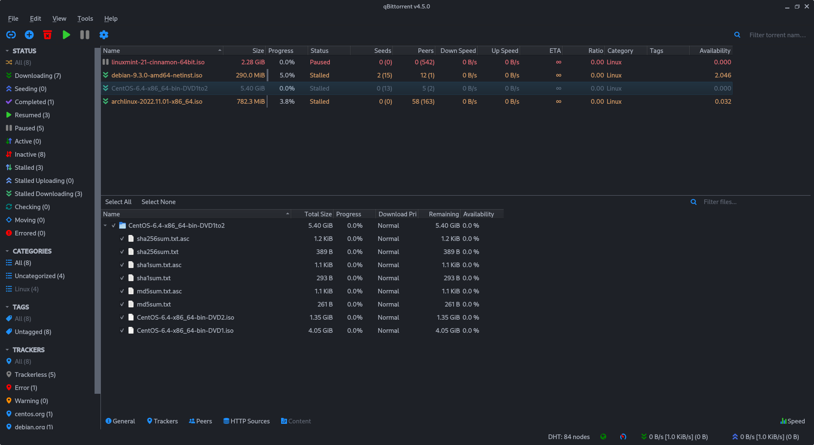
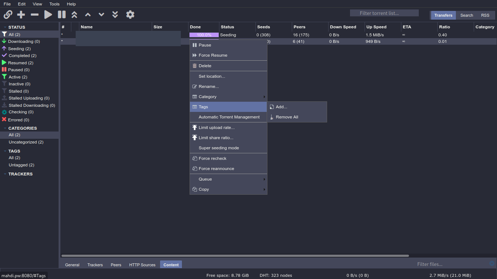

# QBittorrent Theme
[qBittorrent](https://qbittorrent.org/) is a cross-platform free and open-source BitTorrent client.

---

## Application Theme (Client)

### Usage
1. Download your chosen theme:
- [dracula](./dracula.qbtheme)
- [gruvbox-dark](./gruvbox-dark.qbtheme)
- [onedark](./onedark.qbtheme)

2. Go to your qBittorrent application:
   1. Enable theme selection from menu. (Tools -> Options -> Behavior -> Interface -> Use custom UI Theme)
   2. In `UI Theme file` click on the file icon and in the file picker, select your `.qbtheme` file. 
   3. Restart qbittorrent to apply theme.

### Screenshots
> dracula.qbtheme


> gruvbox-dark.qbtheme


> onedark.qbtheme


### Theme Development
[How to create your theme? - Reference](https://github.com/qbittorrent/qBittorrent/wiki/Create-custom-themes-for-qBittorrent)

This theme is added to [qbittorrent](https://github.com/qbittorrent/qBittorrent)'s wiki page on github. [Click Here](https://github.com/qbittorrent/qBittorrent/wiki/List-of-known-qBittorrent-themes)

Qbittorrent theme is orginally a single '.qbtheme' file
that you can select and use in qbittorrent preferences,
which you need to compile a '.qrc' file with [rcc](https://doc.qt.io/qt-5/rcc.html).

You can edit stylesheet.qss, config.json to start
making your very own qbittorrent theme!

My theme contains:

| Name			| Desc				                          |
| --------------------- |-----------------------------------|
| resources.qrc		| Resources for compiling	          |
| stylesheet.qss.in	| stylesheet's template		           |
| config.json.in	| GUI colors template		             |
| stylesheet.qss	| stylesheet (dracula by default)		 |
| config.json		| GUI colors (dracula by default)		 |

#### Compile
Compiling this theme requires [rcc](https://doc.qt.io/qt-5/rcc.html).

Now we can generate our theme:
```
 $ rcc resources.qrc -o example.qbtheme -binary
// resouces.qrc: list of the files
// example.qbtheme: name of your theme
```

#### Theme Generator
I've made [a script](./src/generate.sh), which uses your `~/.Xresources` file, in order to generate a QBittorrent theme file.
```
 $ chmod +x generate.sh
 $ ./generate.sh
// creates `example.qbtheme` from your `~/.Xresources`.
 $ ./generate.sh nord.qbtheme
// creates `nord.qbtheme`.
```

#### TODO
- [ ] theme generator should read colors from a file. Not the `~/.Xresources`. (since non-Xorg systems won't work, like wayland)
- [ ] make better color implementation for stylesheet.

---

## WebUI Theme (Server)

### Usage

1. Clone the repository:
    ```
    cd /opt
    git clone https://github.com/MahdiMirzade/qbittorrent.git
    chmod -R 777 qbittorrent
    ```
2. Enable theme selection from menu: → Tools → Options → Web UI → Use alternative Web UI.
3. In 'Files locations' bar, you should type `/opt/qbittorrent/webui` .

#### Troubleshooting WebUI Theme (Server)
If you found you have put the file/folder in the wrong spot and get the error `Unacceptable file type, only regular file is allowed`
* Append the following after the url/port in your browser and then refresh (this clears the webui setting back to disabled):
```
/api/v2/app/setPreferences?json=%7B%22alternative_webui_enabled%22:false%7D
```

### Screenshots


### Developement
From qBittorrent v4.1.0 and on, the WebUI architecture was expanded to allow the use of alternate sets of WebUI sources, allowing customization of the WebUI and usage of community developed alternatives.

In WebUI you are not going to produce a theme, you are going to modify the current core of the qBittorrent core, which I wrote a custom stylesheet to produce this WebUI, but you are not limited to this.
This theme contains a `custom-webui.css` file that is basically the whole show, you may want to modify this file in `public/css` and `private/css` to change the theme and modify it on your own.

For more information about WebUI developement [click here](https://github.com/qbittorrent/qBittorrent/wiki/Developing-alternate-WebUIs-(WIP)).
